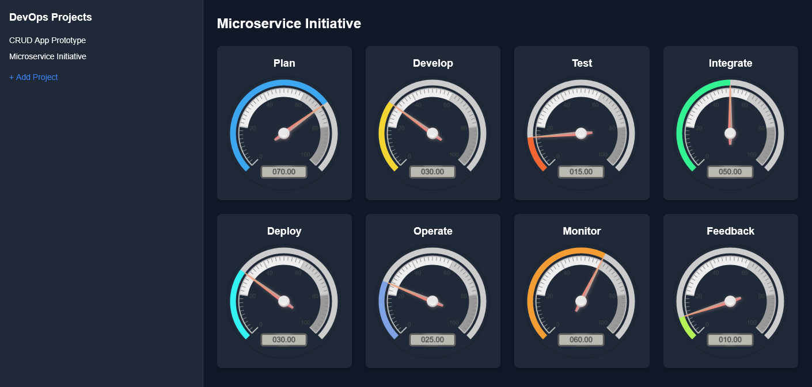

# 🚀 DevOps Project Velocity Tracker

A lightweight web app to track DevOps project velocity. Built to run as a single Docker container.

---



## 🐳 Quick Start (Docker)

```bash
docker pull whkirk/devops-velocity
docker run -it -p 9001:80 whkirk/devops-velocity
```
Open your browser to http://localhost:9001

### Build
```bash
# Clone the repo
git clone https://github.com/hunterkirk/devops-velocity.git
cd devops-velocity

# Build the Docker image
docker build -t devops-velocity .

# Run the container
docker run -p 9001:80 devops-velocity
```

### Edit project name
* Right click over project.

### Set velocity for lifecycle 
* Click on gauge.